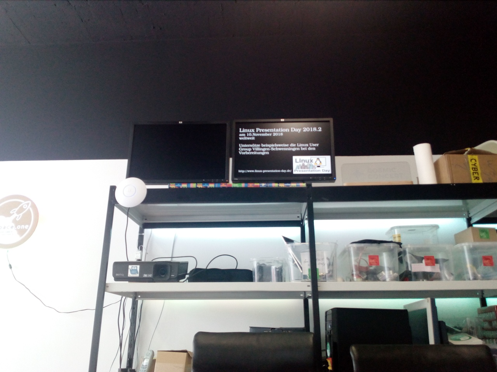

# spaceinfo

This repo provides as interface for displaying multiple webpages in a slideshow.

## So sieht das bei uns aus:


## Install
Install python, pip, flask.

## Run
```
bash run.sh
```
This runs on localhost. You have to configure your nginx or apache to redirect to port 8080 from the given url.

## How to add slides?
To add slides you should add a subfolder in `pages`. But a `config.ini` file into this directory. This file should look like:
```
[Page-Settings]
# If external link is set; The link is used instead of the local index.html file
#external_link = https://www.netzfrequenz.info/charts/gauge_full.php

# If timeout is set; The page will be shown for this time in seconds. If not set, the default timeout will be used
#timeout = 42

# In which slideshow should this page occur?
slideshows = internal maxpriv
```
You need to specifiy either a `external_link` in your `config.ini` or add a `index.html` file to the directory. You could add you slide to multiple `slideshows` by specifying them separated by a space.

You find some templates in the `templates` directory.

Make PullRequest from a branch in THIS repository! :)

## Schwarze Ränder auf RaspberryPi
Disable Overscan via `raspi-config` - `Advanced Options` - `Overscan`

## Licence
Siehe [LICENCE](LICENCE.md)
